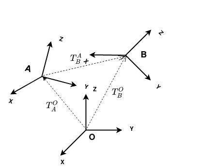

# MSCKF Tutorial

## Introduction
This project contains a basic Multi-Constraint Kalman Filter(MSCKF) implementation to solve the
visual inertial odometry(VIO) problem. The MSCKF is an extended kalman filter first introduced in
X, and is the main way to solve VIO within the EKF framework.

This project should serve as a tutorial. Hopefully, people can read through the codebase
and learn how an MSCKF works. It is a fairly basic implementation, and lacks some of the more modern upgrades such as
the observability constraints. Plus as it is implemented in Python it lacks the speed necessary to run
this on a actual system. If you do want a useful ,performant MSCKF solution then I recommend
the [OpenVINS](https://github.com/rpng/open_vins) project.

## Getting Started

### Installation
The project is developed with [poetry](https://python-poetry.org/docs/basic-usage/) to control the dependencies.
If possible I recommend to setup the project using it, and run the commands with it.

#### Python Virtual environment setup.

It is assumed you already have setup or can setup a python virtual environment.

Install the project to your virtualenv. I recommend using
```pip install -e .```.

### Running examples.

Download one of the runs from the [Euroc](https://projects.asl.ethz.ch/datasets/doku.php?id=kmavvisualinertialdatasets) 
dataset in the ASL format, and unzip the compressed file.

Run the VIO algorithm using the following command

```python ./examples/run_on_euroc.py --euroc_folder <PATH_TO_MH2_MAV0> --use_viewer --start_timestamp 1403636896901666560```

The ```start_timestamp``` is needed right now as we don't run an initialization scheme, and Euroc has
some drastic movement in the beginning to initialize the system. It should be set to timestamp where
the drone is about to take off after the bias initialization movement. Here the value ```1403636896901666560``` is for
the MH02 run.


## Primer on Transforms and Notation

This assumes you already have a basic understanding of rotations, and transforms.

### Basic homogenous transforms.



In the above image you can see 3 coordinate system which we will call Frame **A** and Frame **B** and **O**(for origin).
They are related to each other by a rigid body transform(). Which is composed of a rotation 
 and a translation .

We generally mark our transforms with the coordinate frames.
*  Which can be read as either
    * The transform of Frame **B** in Frame **A**
    * The transform from Frame **A** to Frame **B**.
*  same thing for rotation, and translation .

The simplest way to represent our Transform() is with
a 4x4 homogenous matrix.


This has the advantage multiple advantages:
1. We can chain together transforms with matrix multiplication.
   * 
2. The matrix inverse is equivalent to the transform inverse.


   
3. We can represent a 3D point as a homogenous vector  and are able
to transform it with matrix vector multiplication.
   
### Quaternions

An alternative to the homogenous transform is to store the rotation as a quaternion. Our transform
is then just a pair of the quaternion and rotation, and is equivalent to the homogenous transform.
=%5Cbegin%7Bbmatrix%7DR%20%26%20t%5C%5C%200_3%20%26%201%5Cend%7Bbmatrix%7D)

All the operations discussed above with homogenous transform are possible with the quaternion 
translation pair. You just have to change certain matrix operations to their quaternion equivalent.

For an actual tutorial on Quaternions I recommend For an in depth tutorial on Quaternions I recommend the paper [Quaternion kinematics for the error-state Kalman filter by Joan Solà](https://arxiv.org/abs/1711.02508), which
also discusses how to implement the operations.

### Notation in code

In the code the notation is as follows.

```frame1_X_frame2```


Frames 1,2 can be changed to the actual name of coordinate frames(e.g camera,imu,body,world,...)
```X``` represents some sort of transformation object(e.g T for Transform, R for rotation, t for translation,...)

An example transform is:


```imu_T_camera```

The advantage of this notation is that it allows you to check if two transform
objects are even allowed to be composed together.

Lets imagine we have a point in the camera frame which we want to transform into the IMU
frame. In code this would look like so:

```pt_in_imu=imu_T_camera * pt_in_camera```

here we can see that this is valid as the ```camera``` parts of the names connect.

An invalid example would be:

```pt_in_imu=camera_T_Imu * pt_in_camera```

Here we have a ```pt_in_camera``` connecting with an ```imu``` so we know we have a problem.

Note that this also works with almost all of the transform objects.

```global_T_camera=global_T_imu * imu_T_camera```

Here is a table of all the transformation quantities you can find in the codebase.

| Symbol  | What is represents |
| ------------- | ------------- |
| T            | Rigid Body Transform as a 4x4 homogenous matrix  |
| R  | 3x3 Rotation Matrix  |
| t            | translation  |
| Q  | Hamiltonian Quaternion  |
| JPLQ            | Quaternion in the JPL style  |
| JPLPose  | A rigid body transform stored as a jpl quaternion and translation pair  |

### MSCKF differences

In most literature and in this project you will find that the MSCKF works a little bit
differently in how it handles rigid body transforms. The most significant being the use
of the jpl style quaternions, and that they store the rotation in the opposite direction compared to most people.

#### JPL style Quaternions.

#### Storage of rotation.


## References